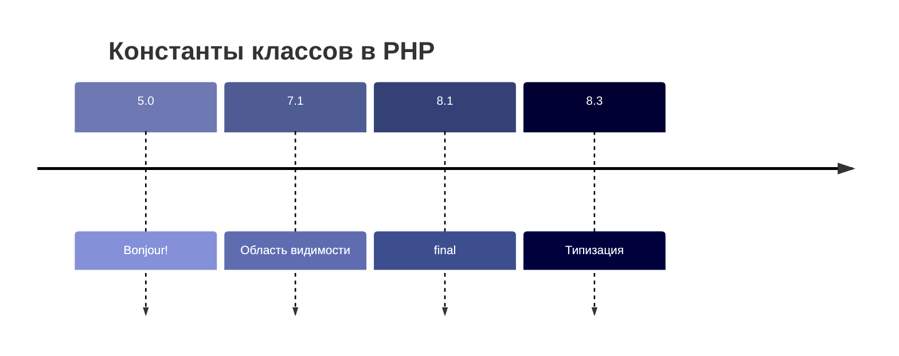

https://mermaid.live/edit#pako:eNptks1Kw0AUhV9lHAnZhNI0ra1ZFhWFCoWCq2ymyW0dmUwknRSkdNEu3Ci4d-HCJ6giWPyprzB5I28mKhYyyTCXc879SJg7o2ESAfWpZc245MonM2KLZNyDKQjbJ3YEw2xsO8RW5xBDqYxYJpRNfsUzlnI2FDBBdxZIOxyETEC9yO7uHbY7Xa_oL9UTOa02emwIorRGZtnOH8o1cvOo1d3fRlUbBuVWoxpG9rym297bQlUbBtWoRnlGruPytr-q2jAo7z8qkHOCj2UFUvEYBJdQVEoA0fd6oz_zRb7UKzyX-Q3Rb_pdr1BaoPVM8O0f9wPZqtV90k3kRZKlO4Fs11yf6Af99BNe5rcY1Wv9gvtDbwxyHchOkRtxyURRe9jziIEv3K_Yd63X-R11aAxpzHiE44H3SkhAzX0H1MdSQqZSbKf4GxhlmUoGVzKkvkozcGh2GTEFB5yNUxZTf8TEBFWIuErS03LkzOTNvwFuw-Jl
